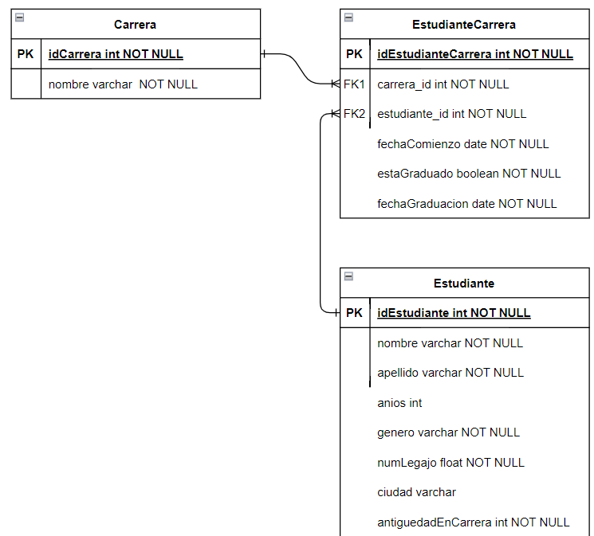
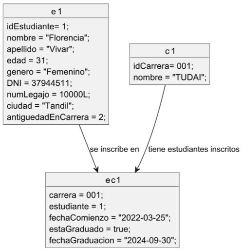

# Arquitecturas web

## Integrantes:
- Bedini Pia Maria pbedini@alumnos.exa.unicen.edu.ar
- Vivar Florencia daianavivar93@gmail.com
- Cusato Santiago santiagocusato@gmail.com
- Fleitas Matías Nicolas mfleitas@alumnos.exa.unicen.edu.ar
- Navarrete Carolina caro.45navarrete@gmail.com

## Diagrama de Entidad Relación *DER*

## Diagrama de Objetos

##  Configuración del proyecto

    Docker: mediante el archivo docker-compose.yml se puede levantar el servidor. El mismo define una configuración para ejecutar dos servicios en contenedores: MySQL y phpMyAdmin.
    
    Funcionamiento : Al ejecutar docker-compose up en la misma carpeta donde está este archivo docker-compose.yml, Docker Compose:
    
    - Descarga las imágenes de MySQL y phpMyAdmin si no están presentes localmente.
    - Crea y ejecuta los contenedores según las configuraciones especificadas.
    - MySQL se inicia, configurando la contraseña de "123" y creando la base de datos mysql2.
    - phpMyAdmin se inicia y se configura para conectarse a la instancia de MySQL.
    - Se puede acceder a phpMyAdmin mediante http://localhost:8081 para gestionar la base de datos.
    
    pom.xml: gestor de dependencias maven.

## Ejecución
  Descargar repositorio y abrir en un entorno de desarrollo.

  1. Ejecutar en consola docker compose up.
  2. Corroborar conexion a base de datos con user:root, password: 123 y dbName: mysql2.
  3. Ejecutar main, src/main/java/Integrador2/Main.java.
  4. La misma creara el esquema y completara con los datos.
